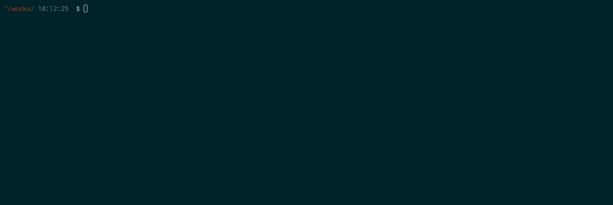

# Dockerfile for Glassfish5

The Dockerfile generates Glassfish5 image which is built for Java EE 8.

## Description

Glassfish5 is the Java EE 8 application server as a reference implementation.
It is built almost everyday for Final Release on July-2017.
This Dockerfile enables you to get a Glassfish5 build archive, install it and run it instanlty.

## Demo

## Features

- Two types of build
  - [Nightly](http://download.oracle.com/glassfish/5.0/nightly/)
    - [latest](http://download.oracle.com/glassfish/5.0/nightly/)
  - [Promoted](http://download.oracle.com/glassfish/5.0/promoted)
- Based on Oracle Java
  - [Oracle Java 8 SE (Server JRE)](https://store.docker.com/images/oracle-serverjre-8)
- User/Password initial setup

## Requirement

- Docker store account
- Checkout Oracle Java in Docker store

## Usage

`docker pull shinyay/docker-glassfish5`

## Installation

### Startup
`docker run -it --rm -p 4848:4848 shinyay/docker-glassfish5`

### Access Glassfish Concole
Glassfish Console: http://localhost:4848

- user: admin
- password: glassfish

## Licence

Released under the [MIT license](https://gist.githubusercontent.com/shinyay/56e54ee4c0e22db8211e05e70a63247e/raw/44f0f4de510b4f2b918fad3c91e0845104092bff/LICENSE)

## Author

[shinyay](https://github.com/shinyay)
